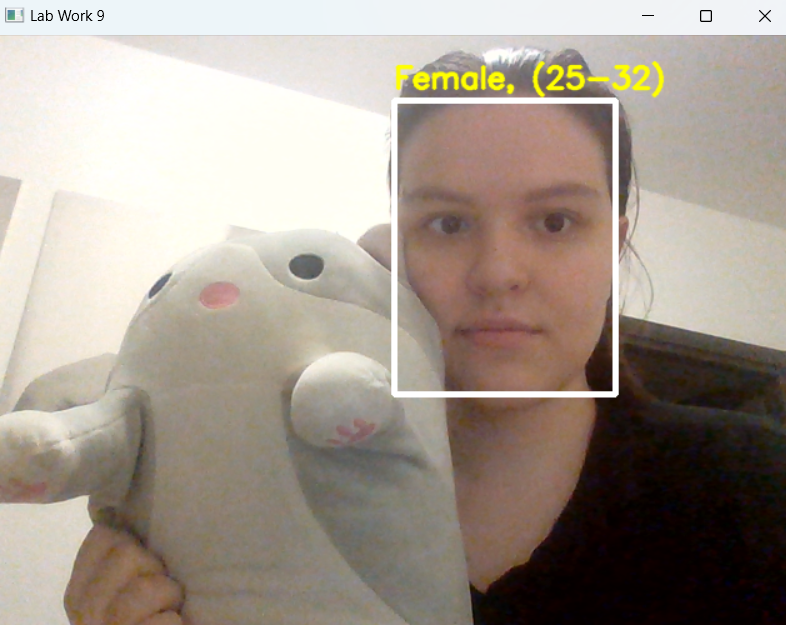
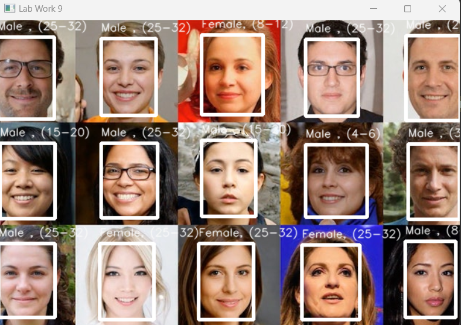

# OpenCV Face Age Gender Detection

Учебный проект на Python для обнаружения лиц и определения предполагаемого возраста и пола человека с использованием OpenCV.

## Цель

На практике изучить применение компьютерного зрения для обнаружения лиц и классификации обнаруженных лиц по предполагаемому возрасту и полу.

## Логика проекта

1. Подключение библиотеки `cv2`.
2. Получение изображения с веб-камеры.
3. Обнаружение лиц на изображении с помощью модели OpenCV DNN.
4. Выделение обнаруженных лиц рамками.
5. Определение предполагаемого пола человека.
6. Определение предполагаемого возраста человека.
7. Вывод результатов непосредственно на изображение.
8. Обработка видеопотока с камеры в режиме реального времени.
9. Возможность обработки изображения, переданного программе на вход.

## Что реализовано

* обнаружение лиц на изображении;
* обнаружение лиц в видеопотоке;
* определение предполагаемого возраста;
* определение предполагаемого пола;
* визуальное выделение обнаруженных лиц;
* обработка изображений и видеопотока;
* использование готовых моделей OpenCV DNN.

## Результат работы

### Обработка изображения с камеры



### Обработка изображения



## Используемые модели

Для работы программы используются предварительно обученные модели:

* `opencv_face_detector_uint8.pb` и `opencv_face_detector.pbtxt` — обнаружение лиц;
* `age_deploy.prototxt` — конфигурация модели определения возраста;
* `gender_deploy.prototxt` — конфигурация модели определения пола.

## Структура проекта

```text
OpenCV-Face-Age-Gender-Detection/
├── images/
├── age_deploy.prototxt
├── gender_deploy.prototxt
├── main.py
├── opencv_face_detector.pbtxt
├── opencv_face_detector_uint8.pb
└── README.md
```

## Технологии

* Python
* OpenCV
* OpenCV DNN
* Computer Vision
* обработка изображений
* обработка видеопотока
* готовые модели машинного обучения

## Результат

В рамках проекта реализована система компьютерного зрения, которая обнаруживает лица на изображениях и видеопотоке и определяет предполагаемый возраст и пол обнаруженных людей с использованием готовых моделей OpenCV.
